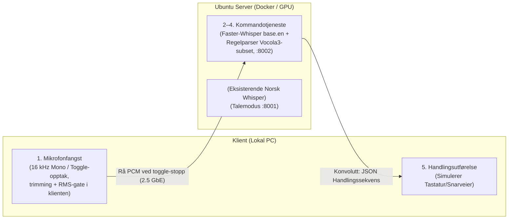

# Kravspesifikasjon: Kommandogrensesnitt (Prototype)

> [!info] **Dokumentstatus**
> **Prosjektfase:** Prototype – Fase 2 (Kommandomodus)  
> **Status:** Arbeidsdokument (amendert etter grilling 2026-08-22, se §8 Beslutningslogg)  
> **Forutsetning:** Prototype for talemodus (norsk diktering via `Necklace/faster-nb-whisper-large`) er ferdigstilt. Denne spesifikasjonen isolerer og definerer **kommandodelen** for testing og verifisering av ytelse og nøyaktighet før systemene kobles sammen.

---

## 1. Formål og Avgrensning

### 1.1 Formål
Formålet med denne prototypen er å utvikle og teste et dedikert, ultra-lavlatens kommandogrensesnitt for datastyring basert på engelske stemmekommandoer. Systemet skal ta imot korte stemmekommandoer, transkribere dem via en spesialisert lettvektsmodell på GPU, mappe dem mot en definert grammatikk ([Vocola3](https://vocola.net/v3/FormalGrammar)-subset), og returnere en sekvens av handlinger (tastetrykk og forsinkelser) som utføres på klientmaskinen.

### 1.2 Avgrensning (Scope)
* **Inkludert:** 
  * Lydopptak med bufferet opplasting av engelske kommandoer fra klient til lokal GPU-server over 2.5 GbE nettverk.
  * GPU-akselerert transkripsjon ved bruk av `faster-whisper` (`base.en` / `tiny.en`).
  * Parsing av tekst mot et definert subset av Vocola3-grammatikk.
  * Generering og sending av strukturerte JSON-handlingssekvenser.
  * Utførelse av tastaturhandlinger lokalt på klient-OS.
* **Ekskludert i denne fasen:**
  * Automatisk svitsjing/veksling mellom talemodus (diktering) og kommandomodus.
  * Kompleks flerspråklig ruting.
  * Avanserte LLM-baserte resonneringer (fokus er deterministisk grammatikkparsing).

---

## 2. Systemarkitektur

Systemet benytter en klient-server-modell over lokalt 2.5 GbE nettverk. All beregning og parsing utføres på Ubuntu GPU-serveren, mens klienten kun håndterer opptak og utførelse av OS-kommandoer.



---

## 3. Infrastruktur og Docker-konfigurasjon

Kommandomodus kjører som **én samlet tjeneste** på serveren: ASR og parser i samme prosess (egen tynn FastAPI-wrapper rundt `faster-whisper`-biblioteket). Dette gir full kontroll over `initial_prompt`, `beam_size` og `temperature` (FK-2.2/FK-2.3) og fjerner både koordinator-leddet og OpenAI-API-overhead. Den eksisterende norske dikteringstjenesten berøres ikke.

Se `server/docker-compose.yaml` i repoet:

```yaml
services:
  command-service:
    build:
      context: .
      dockerfile: command-service/Dockerfile
    container_name: voice-command-service
    restart: unless-stopped
    ports:
      - "8002:8000"
    environment:
      COMMAND_MODEL: base.en
      WHISPER_DEVICE: cuda
      WHISPER_COMPUTE_TYPE: int8_float16
      GRAMMAR_PATH: /etc/command-grammar/rules.yaml
    volumes:
      - ./grammar:/etc/command-grammar:ro
    deploy:
      resources:
        reservations:
          devices:
            - driver: nvidia
              count: 1
              capabilities:
                - gpu
```

> [!tip] **GPU-ressurser**
> Kommandotjenesten deler samme fysiske GPU som den store norske modellen. `base.en` krever kun ~150–290 MB VRAM og vil derfor ikke påvirke ytelsen eller minnekapasiteten til den store modellen.

---

## 4. Funksjonelle Krav (FK)

### FK-1: Lydfangst og Klientoverføring
* **FK-1.1:** Klienten skal ta opp lyd i **16 kHz, 16-bit mono PCM** (bufferes i minnet, ikke tempfil).
* **FK-1.2:** Aktivering skjer via **toggle-opptak** (samme tast starter og stopper). Før sending klipper klienten bort stillhet (**energi-trimming**), forkaster opptak under terskel/varighet (**RMS-gate**) og sender automatisk ved **opptakstak** på 8 sekunder.
* **FK-1.3:** Det trimmede PCM-klippet overføres til kommandotjenesten (port 8002) som rå bytes i én HTTP POST ved toggle-stopp.

### FK-2: Talegjenkjenning på Server (ASR)
* **FK-2.1:** Modellen skal kjøre på dedikert GPU via `faster-whisper` (`base.en` i `int8_float16` eller `float16`).
* **FK-2.2:** ASR-tjenesten skal benytte `initial_prompt` med det gyldige kommandovokabularet for å tvinge modellen mot korrekte engelske nøkkelord.
* **FK-2.3:** Inferens skal kjøres med `beam_size=1` og `temperature=0.0` for maksimal hastighet og deterministisk resultat.

### FK-3: Grammatikkparsing (Vocola3-subset)
* **FK-3.1:** Parseren skal ta imot ren tekststreng fra ASR-modulen.
* **FK-3.2:** Parseren skal støtte enkle direkte regler (f.eks. `copy that = ...`) samt regler med parametere/valg (f.eks. `open (chrome | terminal) = ...`).
* **FK-3.3:** Parseren skal oversette en gjenkjent regel til en kronologisk liste over diskrete handlinger (`keypress`, `wait`, `type_text`).

### FK-4: JSON Handlingsprotokoll
* **FK-4.1:** Serveren skal svare klienten med en standardisert **konvolutt**: `status` (`ok` | `unknown` | `error`), hørt tekst, matchet regel, handlingssekvens og timing. Klienten utfører handlingene kun ved `status: "ok"`.
* **FK-4.2:** Protokollen skal støtte modifikasjonstaster (`ctrl`, `alt`, `shift`, `super`/`cmd`) kombinert med enkelt-taster, samt eksplisitte tidsforsinkelser (`wait` i millisekunder).

---

## 5. Datamodell: Konvolutten (JSON-handlingsprotokoll)

Når en kommando er gjenkjent og parset, returnerer kommandotjenesten en konvolutt med status, hørt tekst, matchet regel, handlingssekvens og timing.

### Spesifikasjon av handlingsobjekter:
1. **`keypress`**: Utfører ett eller flere samtidige tastetrykk.
   * `action`: `"keypress"`
   * `keys`: Liste over taster (f.eks. `["ctrl", "c"]`, `["enter"]`, `["shift", "up"]`).
2. **`wait`**: Pause mellom operasjoner (nødvendig for at OS/applikasjoner skal rekke å reagere).
   * `action`: `"wait"`
   * `ms`: Antall millisekunder.
3. **`type_text`** *(valgfri)*: Skriver inn en rå tekststreng.
   * `action`: `"type_text"`
   * `text`: Strengen som skal skrives.

### Eksempel på mottatt konvolutt:
```json
{
  "status": "ok",
  "heard": "reformat block",
  "rule": "reformat_block",
  "actions": [
    {"action": "keypress", "keys": ["enter"]},
    {"action": "keypress", "keys": ["shift", "up"]},
    {"action": "keypress", "keys": ["ctrl", "b"]},
    {"action": "keypress", "keys": ["enter"]},
    {"action": "keypress", "keys": ["ctrl", "a"]},
    {"action": "keypress", "keys": ["ctrl", "c"]},
    {"action": "keypress", "keys": ["alt", "tab"]},
    {"action": "wait", "ms": 150},
    {"action": "keypress", "keys": ["ctrl", "v"]}
  ],
  "timing_ms": {"total": 41.2, "asr": 38.9, "parse": 0.1}
}
```

Ved ukjent kommando: `{"status": "unknown", "heard": "elephant", "rule": null, "actions": [], "timing_ms": {...}}` – klienten viser tilbakemelding og trykker ingen taster.

---

## 6. Ikke-funksjonelle Krav (NFK)

### NFK-1: Ytelse og Responstid
* **NFK-1.1 (Ende-til-ende latens):** Total tid fra brukeren trykker toggle for å stoppe opptak til første tastetrykk utføres på klient-OS skal være under **100 ms** over kablet 2.5 GbE nettverk.
* **NFK-1.2 (GPU Inferenstid):** ASR-inferens for `base.en` på GPU skal fullføres innen **20 ms** for korte lydklipp. *Målverdi, ikke hardt krav – justeres etter målinger (beslutningslogg Q9).*
* **NFK-1.3 (Parser-tid):** Grammatikkparsing skal ta **< 2 ms**.
* **NFK-1.4 (Instrumentering):** Konvolutten skal alltid inneholde `timing_ms` per etappe; klienten logger ende-til-ende-latens (slipp → første tastetrykk) per kommando.

### NFK-2: Maskinvare og Miljø
* **Server:** Ubuntu Linux med NVIDIA GPU (CUDA-støtte).
* **Nettverk:** Kablet 2.5 GbE svitsjet nettverk med ping/RTT < 1 ms.
* **Klient:** Støtte for Python-basert eller native OS-tastatursimulering (f.eks. via `pynput` eller `pyautogui`).

---

## 7. Test- og Akseptansekriterier for Prototypen

| ID        | Testscenario                                                        | Forventet resultat                                                                                 | Status |
| :-------- | :------------------------------------------------------------------ | :------------------------------------------------------------------------------------------------- | :----- |
| **TC-01** | Si *"Copy That"* via toggle.                                        | Mottar konvolutt med `[{"action": "keypress", "keys": ["ctrl", "c"]}]`. Total tid < 100 ms.         | [ ]    |
| **TC-02** | Si en kompleks makro (sekvens med navigering, markering og liming). | Klienten mottar handlingssekvensen og utfører alle stegene i korrekt rekkefølge med overholdte pauser. | [ ]    |
| **TC-03** | Si et ord som ikke finnes i grammatikken (f.eks. *"Elephant"*).     | Konvolutt med `status: "unknown"`; ingen taster trykkes, serveren krasjer ikke.                     | [ ]    |
| **TC-04** | Bakgrunnsstøy/stille opptak via toggle.                             | Ingen feilaktige tastetrykk trigges lokalt på klienten (RMS-gate/trimming forkaster sending).       | [ ]    |

---

## 8. Beslutningslogg (grilling 2026-08-22)

Arkitektur- og kravavgjørelser fattet under grillingen; disse amender originalspesifikasjonen:

| # | Avgjørelse | Begrunnelse |
|---|------------|-------------|
| Q1 | Egen tynn FastAPI-wrapper rundt faster-whisper i stedet for ferdigimage (`fedirz/faster-whisper-server` er arkivert) | Full kontroll over `initial_prompt`/`beam_size`/`temperature`; ingen OpenAI-API-overhead |
| Q2 | Bufferet opplasting ved toggle-stopp (rå PCM, én HTTP POST); ikke ekte strømming | faster-whisper er batch-basert; strømming = senere optimering kun hvis målingene tilsier det |
| Q3 | Samme repo som dikteringsklienten, egen modul/entrypoint (`command_client.py`) | Isolert nok til å teste alene, deler infrastruktur uten duplisering |
| Q4 | Regler i YAML (Vocola3-subset-semantikk), ikke ekte `.vcl`-filer | Deterministisk, trivielt å generere `initial_prompt` fra; `.vcl` kan komme senere |
| Q5 | **Toggle + energi-trimming + RMS-gate + opptakstak**, ikke Push-to-Talk | Gjenbruker fase 1-infrastruktur; trimming gir nesten like stramme klipp; FK-1.2 amendert |
| Q6 | Ukjent kommando → visuell tilbakemelding (overlay), aldri tastetrykk; ingen auto-retry | TC-03; deterministisk oppførsel |
| Q7 | Støyhåndtering som klientgate (RMS + minimumslengde); ingen VAD i fase 2 | Billigst og raskest |
| Q8 | Monorepo: serverkode under `server/` | Kravspek, klient og server samlet |
| Q9 | NFK-1.2 (<20 ms ASR) behandles som målverdi; ende-til-ende-instrumentering fra dag én | Realistisk latensavklaring gjennom måling, ikke design rundt udokumentert tall |
| Q10 | `type_text` støttes i protokoll og klient, men ingen regler bruker den ennå | Billig å ha med fra starten |
| Q11 | Koordinator slås sammen med parser + ASR til **én kommandotjeneste** (:8002) | Fjerner et nettverkshopp og en container i fase 2; koordinator gjenoppstår i fase 3 ved modus-ruting |
| Q12 | Streng matching etter normalisering; fuzzy matching utsettes | Grammatikken definerer vokabularet; match/miss er binært. Feilhør tas først med målinger |
| Q13 | Svar som konvolutt (`status`/`heard`/`rule`/`actions`/`timing_ms`), ikke naken array | TC-03 krever grunnlag for tilbakemelding; timing trengs til NFK-verifisering |
| Q14 | Startregelsett på ~7 regler + én kompleks makro | Stort nok til å teste valggrupper, lite nok til manuell verifisering |
| Q15 | Opptakstak overskrides → klippet sendes automatisk | Verste fall `unknown`; ingen kommando mister uventet |

**Etterskudd 2026-08-22 (feltdata):** Første taledel-gate (`min_speech_ratio`, andel høylydte vinduer av hele klippet) forkastet ekte tale: toggle-opptak inneholder betenkningsstillhet som fortynner andelen uansett taleinnhold (målt: avvist 2132 ms-klipp hadde ~310 ms tale – mer enn det godkjente). Erstattet med **`min_loud_ms`** – absolutt ms taleenergi, lengde-uavhengig. Samme målerunde bekreftet E2E-latens **93,2 ms < 100 ms-målet (NFK-1.1 ✓)** etter sentinel-fiks i opptakeren.

Se `CONTEXT.md` for den avklarte terminologien (toggle-opptak, energi-trimming, RMS-gate, konvolutt osv.).