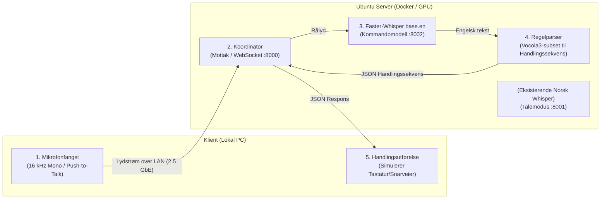

# Kravspesifikasjon: Kommandogrensesnitt (Prototype)

> [!info] **Dokumentstatus**
> **Prosjektfase:** Prototype – Fase 2 (Kommandomodus)  
> **Status:** Arbeidsdokument  
> **Forutsetning:** Prototype for talemodus (norsk diktering via `Necklace/faster-nb-whisper-large`) er ferdigstilt. Denne spesifikasjonen isolerer og definerer **kommandodelen** for testing og verifisering av ytelse og nøyaktighet før systemene kobles sammen.

---

## 1. Formål og Avgrensning

### 1.1 Formål
Formålet med denne prototypen er å utvikle og teste et dedikert, ultra-lavlatens kommandogrensesnitt for datastyring basert på engelske stemmekommandoer. Systemet skal ta imot korte stemmekommandoer, transkribere dem via en spesialisert lettvektsmodell på GPU, mappe dem mot en definert grammatikk ([Vocola3](https://vocola.net/v3/FormalGrammar)-subset), og returnere en sekvens av handlinger (tastetrykk og forsinkelser) som utføres på klientmaskinen.

### 1.2 Avgrensning (Scope)
* **Inkludert:** 
  * Lydopptak og strømming av engelske kommandoer fra klient til lokal GPU-server over 2.5 GbE nettverk.
  * GPU-akselerert transkripsjon ved bruk av `faster-whisper` (`base.en` / `tiny.en`).
  * Parsing av tekst mot et definert subset av Vocola3-grammatikk.
  * Generering og sending av strukturerte JSON-handlingssekvenser.
  * Utførelse av tastaturhandlinger lokalt på klient-OS.
* **Ekskludert i denne fasen:**
  * Automatisk svitsjing/veksling mellom talemodus (diktering) og kommandomodus.
  * Kompleks flerspråklig ruting.
  * Avanserte LLM-baserte resonneringer (fokus er deterministisk grammatikkparsing).

---

## 2. Systemarkitektur

Systemet benytter en klient-server-modell over lokalt 2.5 GbE nettverk. All beregning og parsing utføres på Ubuntu GPU-serveren, mens klienten kun håndterer opptak og utførelse av OS-kommandoer.



---

## 3. Infrastruktur og Docker-konfigurasjon

Tjenestene kjøres samlet i Docker Compose på Ubuntu-serveren. Oppsettet utvider din eksisterende konfigurasjon slik at både den store norske modellen og den lette engelske kommandamodellen kjører side om side på samme GPU.

```yaml
version: '3.8'

services:
  # 1. KOORDINATOR & PARSER (Felles inngangsport for klienten)
  coordinator:
    build: ./coordinator
    container_name: voice-coordinator
    restart: unless-stopped
    ports:
      - "8000:8000"
    environment:
      - SPEECH_WHISPER_URL=http://whisper-speech:8000
      - COMMAND_WHISPER_URL=http://whisper-command:8000
    depends_on:
      - whisper-speech
      - whisper-command

  # 2. EKSISTERENDE WHISPER - Norsk talegjenkjenning (Dikteringsmodus)
  whisper-speech:
    image: fedirz/faster-whisper-server:latest-cuda
    container_name: faster-whisper-speech
    restart: unless-stopped
    ports:
      - "8001:8000"
    environment:
      - WHISPER__MODEL=Necklace/faster-nb-whisper-large
      - PRELOAD_MODELS=["Necklace/faster-nb-whisper-large"]
      - WHISPER__INFERENCE_DEVICE=cuda
      - WHISPER__TTL=-1
      - WHISPER__COMPUTE_TYPE=int8_float16
    deploy:
      resources:
        reservations:
          devices:
            - driver: nvidia
              count: 1
              capabilities:
                - gpu
    volumes:
      - whisper_models:/root/.cache/huggingface

  # 3. NY WHISPER - Engelsk kommandogjenkjenning (Kommandomodus)
  whisper-command:
    image: fedirz/faster-whisper-server:latest-cuda
    container_name: faster-whisper-command
    restart: unless-stopped
    ports:
      - "8002:8000"
    environment:
      - WHISPER__MODEL=base.en
      - PRELOAD_MODELS=["base.en"]
      - WHISPER__INFERENCE_DEVICE=cuda
      - WHISPER__TTL=-1
      - WHISPER__COMPUTE_TYPE=int8_float16
    deploy:
      resources:
        reservations:
          devices:
            - driver: nvidia
              count: 1
              capabilities:
                - gpu
    volumes:
      - whisper_models:/root/.cache/huggingface

volumes:
  whisper_models: {}

networks:
  default:
    name: voice-network
```

> [!tip] **GPU-ressurser**
> Begge modellene deler samme fysiske GPU (`capabilities: [gpu]`). `base.en` krever kun ~150–290 MB VRAM, og vil derfor ikke påvirke ytelsen eller minnekapasiteten til den store norske modellen.

---

## 4. Funksjonelle Krav (FK)

### FK-1: Lydfangst og Klientoverføring
* **FK-1.1:** Klienten skal ta opp lyd i **16 kHz, 16-bit mono WAV/PCM**.
* **FK-1.2:** Aktivering skal skje via en **Push-to-Talk**-mekanisme (hold inne definert hurtigtast mens kommandoen sies).
* **FK-1.3:** Lydpakken skal overføres til `coordinator` (port 8000) over lokalnettet.

### FK-2: Talegjenkjenning på Server (ASR)
* **FK-2.1:** Modellen skal kjøre på dedikert GPU via `faster-whisper` (`base.en` i `int8_float16` eller `float16`).
* **FK-2.2:** ASR-tjenesten skal benytte `initial_prompt` med det gyldige kommandovokabularet for å tvinge modellen mot korrekte engelske nøkkelord.
* **FK-2.3:** Inferens skal kjøres med `beam_size=1` og `temperature=0.0` for maksimal hastighet og deterministisk resultat.

### FK-3: Grammatikkparsing (Vocola3-subset)
* **FK-3.1:** Parseren skal ta imot ren tekststreng fra ASR-modulen.
* **FK-3.2:** Parseren skal støtte enkle direkte regler (f.eks. `copy that = ...`) samt regler med parametere/valg (f.eks. `open (chrome | terminal) = ...`).
* **FK-3.3:** Parseren skal oversette en gjenkjent regel til en kronologisk liste over diskrete handlinger (`keypress`, `wait`, `type_text`).

### FK-4: JSON Handlingsprotokoll
* **FK-4.1:** Serveren skal svare klienten med en standardisert JSON-matrise (array) som beskriver rekkefølgen av handlinger som skal utføres.
* **FK-4.2:** Protokollen skal støtte modifikasjonstaster (`ctrl`, `alt`, `shift`, `super`/`cmd`) kombinert med enkelt-taster, samt eksplisitte tidsforsinkelser (`wait` i millisekunder).

---

## 5. Datamodell: JSON-handlingsprotokoll

Når en kommando er gjenkjent og parset, sender koordinatoren en strukturert liste med operasjoner tilbake til klienten.

### Spesifikasjon av handlingsobjekter:
1. **`keypress`**: Utfører ett eller flere samtidige tastetrykk.
   * `action`: `"keypress"`
   * `keys`: Liste over taster (f.eks. `["ctrl", "c"]`, `["enter"]`, `["shift", "up"]`).
2. **`wait`**: Pause mellom operasjoner (nødvendig for at OS/applikasjoner skal rekke å reagere).
   * `action`: `"wait"`
   * `ms`: Antall millisekunder.
3. **`type_text`** *(valgfri)*: Skriver inn en rå tekststreng.
   * `action`: `"type_text"`
   * `text`: Strengen som skal skrives.

### Eksempel på mottatt JSON-sekvens:
```json
[
  {"action": "keypress", "keys": ["enter"]},
  {"action": "keypress", "keys": ["shift", "up"]},
  {"action": "keypress", "keys": ["ctrl", "b"]},
  {"action": "keypress", "keys": ["enter"]},
  {"action": "keypress", "keys": ["ctrl", "a"]},
  {"action": "keypress", "keys": ["ctrl", "c"]},
  {"action": "keypress", "keys": ["alt", "tab"]},
  {"action": "wait", "ms": 150},
  {"action": "keypress", "keys": ["ctrl", "v"]}
]
```

---

## 6. Ikke-funksjonelle Krav (NFK)

### NFK-1: Ytelse og Responstid
* **NFK-1.1 (Ende-til-ende latens):** Total tid fra brukeren slipper Push-to-Talk-knappen til første tastetrykk utføres på klient-OS skal være under **100 ms** over kablet 2.5 GbE nettverk.
* **NFK-1.2 (GPU Inferenstid):** ASR-inferens for `base.en` på GPU skal fullføres innen **20 ms** for korte lydklipp.
* **NFK-1.3 (Parser-tid):** Grammatikkparsing skal ta **< 2 ms**.

### NFK-2: Maskinvare og Miljø
* **Server:** Ubuntu Linux med NVIDIA GPU (CUDA-støtte).
* **Nettverk:** Kablet 2.5 GbE svitsjet nettverk med ping/RTT < 1 ms.
* **Klient:** Støtte for Python-basert eller native OS-tastatursimulering (f.eks. via `pynput` eller `pyautogui`).

---

## 7. Test- og Akseptansekriterier for Prototypen

| ID        | Testscenario                                                        | Forventet resultat                                                                                 | Status |
| :-------- | :------------------------------------------------------------------ | :------------------------------------------------------------------------------------------------- | :----- |
| **TC-01** | Si *"Copy That"* via Push-to-Talk.                                  | Mottar `[{"action": "keypress", "keys": ["ctrl", "c"]}]`. Total tid < 100 ms.                      | [ ]    |
| **TC-02** | Si en kompleks makro (sekvens med navigering, markering og liming). | Klienten mottar JSON-sekvensen og utfører alle stegene i korrekt rekkefølge med overholdte pauser. | [ ]    |
| **TC-03** | Si et ord som ikke finnes i grammatikken (f.eks. *"Elephant"*).     | Parser returnerer `UNKNOWN_COMMAND` eller tomt handlingssett uten å krasje serveren.               | [ ]    |
| **TC-04** | Bakgrunnsstøy/stille opptak ved Push-to-Talk.                       | Ingen feilaktige tastetrykk trigges lokalt på klienten.                                            | [ ]    |